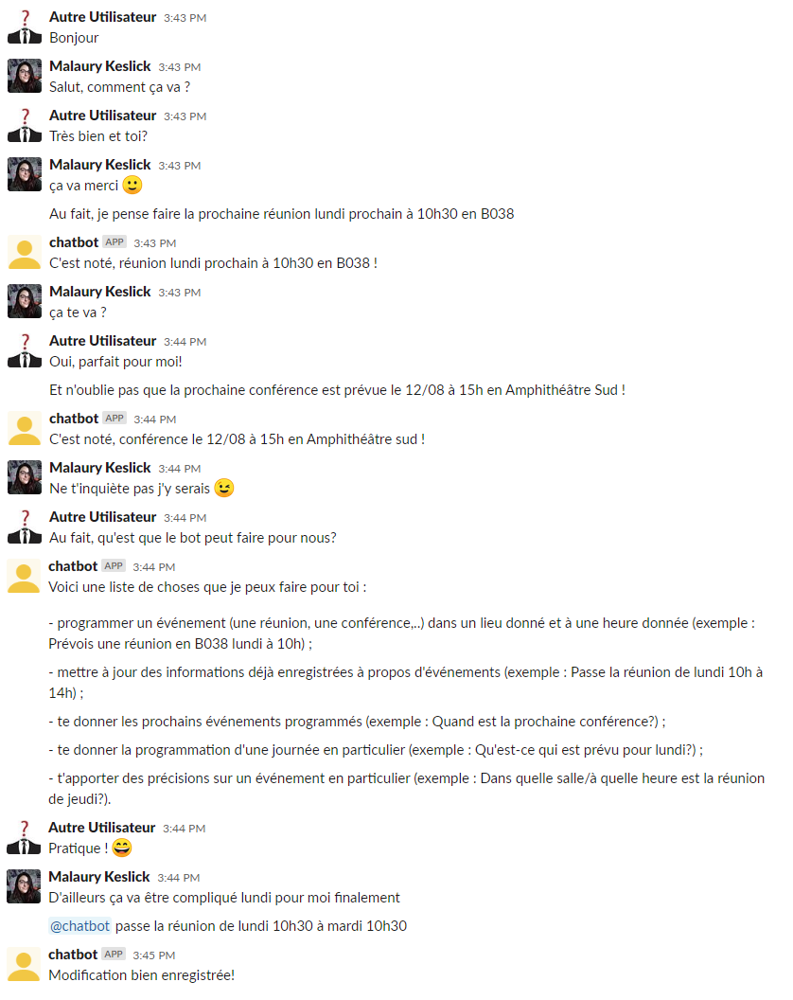

# Instructions de mise en place du projet
> Suivez ces instructions pas à pas pour intégrer le chatbot dans l'application Slack.

## Table of contents
* [Google Cloud](#google-cloud)
* [Firebase](#firebase)
* [Dialogflow](#dialogflow)
* [Integration](#integration)
* [Exemple d'utilisation](#exemple-d-utilisation)
* [Contact](#contact)

## Google Cloud
Dans un premier temps il vous faudra créer un projet sur la [Google Cloud Platform](https://console.cloud.google.com/getting-started). Après la création de ce projet, il vous faudra activer les API nécessaires au bon fonctionnement de ce projet : à l'aide de la barre de recherche, trouvez et activez les API suivantes :

* Cloud Functions
* Dialogflow
* Cloud SQL

Ouvrez ensuite la console cloud en cliquant sur le bouton d'invite de commande en haut à gauche de l'écran. Une fois votre invite de commande initialisée, installez les packages suivants :

* npm install dialogflow
* npm install dialogflow-fulfillment
* npm install firebase-admin
* npm install firebase-functions

Cliquez alors sur les trois petites barres en haut à gauche de l'interface et cliquez sur _Cloud Functions_ dans la section Calcul. Choisissez "Créer une fonction", choissiez son nom et la région désirée. Le déclencheur doit être de type HTTP et vous devez autoriser l'appels non authentifiés. Passez à la page suivante, puis dans la partie _index.js_, collez le contenu du fichier intitulé de la même manière dans le dossier _fulfillment_ présent dans ce dossier du dépôt git. Faites de même pour la partie _package.json_. Modifiez la partie "Point d'entrée" pour _dialogflowFirebaseFulfillment_, et laissez cette page ouverte pour le moment.

## Firebase
Il vous faudra ensuite créer un nouveau projet sur la console [Firebase](https://console.firebase.google.com/), et le relier à votre projet Google Cloud existant. Une fois ce projet créé, rendez vous dans la section _Database_ puis créez une nouvelle base de données. Vous pourrez alors choisir :

* le mode test, qui laissera vos données en libre accès pendant 30 jours, au terme desquels vous devrez mettre à jour les règles de sécurité ;
* le mode production, dans lequel vous devrez directement travailler sur les règles de sécurité pour les rendre accessibles à votre application.

Une fois ce choix validé et votre zone géographique choisie, vous arriverez sur la page principale de votre nouvelle base de données. Dans le panneau à gauche de votre écran, cliquez alors sur l'engrenage situé à droite de la ligne _Vue d'ensemble du projet_, puis sur _Paramètres du compte_, et enfin copier l'ID du projet disponible sur la page nouvellement affichée. Allez ensuite insérer cet identifiant à la ligne 16 du fichier _index.js_ dans votre Google Cloud Function précédemment créée. Vous pourrez ensuite déployer cette fonction. Une fois déployée, cliquez sur le nom de la fonction sur la page affichée à l'écran, puis sur _Déclencheur_, et copiez l'URL qui se trouve dans ce nouvel onglet. Gardez-le sous la main pour la partie suivante.

## Dialogflow
Il vous reste alors à créer un projet dans la console [Dialogflow](https://dialogflow.cloud.google.com/), et le relier à votre projet Google Cloud existant. Ensuite, dans le panneau à gauche de votre écran, cliquez sur l'engrenage se trouvant à droite du nom de votre projet. Rendez vous dans la section _Export and Import_ de la page nouvellement affichée, et choisissez l'option _Restore from ZIP_. Sélectionnez alors _DialogflowExport.zip_ que vous trouverez dans ce dossier du dépôt Git.  

Une fois le projet mis à jour, rendez-vous dans la section _Fulfillment_, dans le panneau à gauche de l'écran. Si ce n'est pas déjà le cas, autorisez les appels au Webhook. Vous devrez ensuite coller l'URL récupéré en fin de section [Firebase](#firebase) dans la section URL de cette page. Sauvegardez.

### Integration
Nous allons maintenant passer à la partie intégration du chatbot dans l'application Slack. Tout d'abord, vous devez avoir créé votre nouvelle équipe Slack. Ensuite, depuis la section _Integration_ disponible dans le panneau de gauche de l'interface Dialogflow, cliquez sur Slack dans la partie _Text based_. Suivez les instructions du tutoriel présenté. Votre chatbot est désormais prêt à être utilisé dans Slack selon les autorisations que vous avez choisi de lui donner dans cette dernière section.

## Exemples d'utilisation

 
 

## Contact
Created by [@maulray](https://github.com/Maulray) - n'hésitez pas à me contacter pour plus d'informations!
Pour mieux comprendre comment ajouter de nouvelles fonctionnalités, je vous invite à lire mon rapport, disponible à la racine de ce projet, qui explique comment j'ai obtenu ce qui est actuellement possible.
